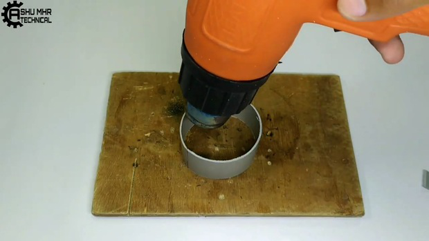
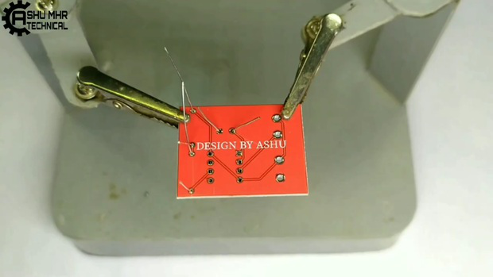

# DIY Cycle Tail Lights
>**STORY**
>
> Do you commute by bike but are worried about being visible to other
> vehicles? Keep yourself safe with cycle tail lights! It may seem hard
> because there are so many options out there, but trust me\--you\'re
> going to want these one\'s. Make your bike safe with these quick, easy
> DIY cycle tail lights! They attach easily to any kind of bike:
> mountain bikes, road bikes, recumbent bikes\--you name it! Check out
> this tutorial for step-by-step instructions.
>
> **Supplies:**
>
> Get all the components ready.

 

> **Step 1: Get Your PCB Ready!**

**Talking about electronics.**

> After making the circuit diagram I transformed it into a PCB design to
> produce it, to produce the PCB, I have chosen the best PCB supplier
> and the cheapest PCB provider to order my circuit. with the
>
> reliable platform, all I need to do is some simple steps which we will
> talk later.

 

> Related Download Files\
> **As you can see in the pictures above the PCB is very well
> manufactured and I've got the same PCB assembled with all the
> components that we want to use for our main board and all the labels
> and logos are there to guide me during the soldering steps. You can
> also download the Gerber  le for this circuit from the download link
> below in case you want to place an order for the same circuit
> design.**

 

 

 

 

**Step 2: Making Custom PVC Designed Body.**

> Designing and molding body.(Dimensions
> as per your requirement).

 
 

 
 

 
 

 
 

 
 

 
 

 
 

 
 

 
 

**Step 3: Placing Led on PCB & Soldering.**

> Placing Led on PCB & Soldering it in parallel connection.\
> Then Sticking the PCB to custom designed PVC enclosure.

 
 

 
 

 
 

 
 

 
 

 
 

**Step 4: Place All the Components on PCB and Solder It Properly.**

> Soldering the components to PCB.

 
 

 
 

 
 

 
 

 
 

**Step 5: Connection of Battery and Charging Circuit.**

> Connecting Battery And Charging Circuit To PCB.

> Solder the battery connector to charging module and add a switch in
> between negative terminal. All the polarities are mentioned on the
> PCB.

 
 

 
 

 
 

 
 

 
 

 
 

 
 

 
 

 
 

 

 
 

 
 

**Step 6: Soldering Remaining Connections & Enclosing the Body.**

> Now solder the wires from LED, Battery, and Switch.
>
> Then stick all the remaining joints of PVC body with super glue.

 
 

 
 

 
 

 

 
 

> **Step 7: Testing**
>
> Finally testing the DIY Cycle Tail Lights.
>
> Keep yourself safe with cycle tail lights! Make your bike safe with
> these quick, easy DIY cycle tail lights!
>Download Gerber file from [HERE](https://cdn.hackaday.io/files/1877248031583616/Gerber%20PCB%20cycle.zip).

**New users will also get some coupons while registering at [JLCPCB](https://jlcpcb.com/IAT) via this blue
link.**

**Thank you for reading this guide, hopefully**, **this guide provides
full steps to help you to create your own DIY this guide provides full
steps to help you to create your own DIY**

**Cycle Tail Lights. If you have any questions please post them in the
comment section below.**

 
 

 

 
 

 
